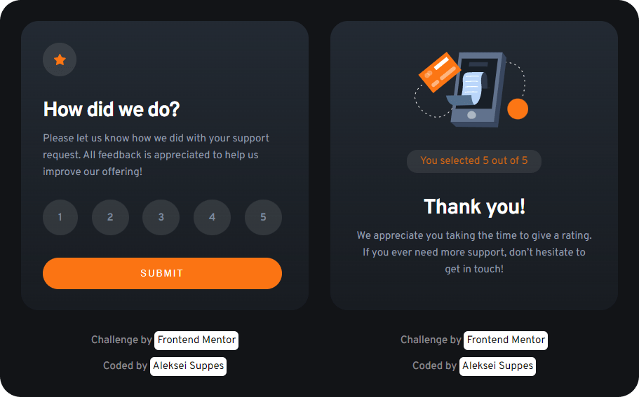

# Frontend Mentor - Interactive rating component solution

This is a solution to the [Interactive rating component challenge on Frontend Mentor](https://www.frontendmentor.io/challenges/interactive-rating-component-koxpeBUmI). Frontend Mentor challenges help you improve your coding skills by building realistic projects. 

## Table of contents

- [Overview](#overview)
  - [The challenge](#the-challenge)
  - [Screenshot](#screenshot)
  - [Links](#links)
- [My process](#my-process)
  - [Built with](#built-with)
  - [What I learned](#what-i-learned)
  - [Continued development](#continued-development)
  - [Useful resources](#useful-resources)
- [Author](#author)

## Overview

### The challenge

Users should be able to:

- View the optimal layout for the app depending on their device's screen size
- See hover states for all interactive elements on the page
- Select and submit a number rating
- See the "Thank you" card state after submitting a rating

### Screenshot

### Links

- Solution URL: [Frontend Mentor Solution](https://www.frontendmentor.io/solutions/interactive-rating-component-ttRIehA2T9)
- Live Site URL: [GitHub Pages](https://lexsupdev.github.io/Interactive-rating-component/)

## My process

### Built with

- Semantic HTML5 markup
- CSS custom properties
- Flexbox
- SCSS
- JavaScript

### What I learned

I learned JavaScript basics and practice to use handlers.

### Continued development

Due to comment on my solution, i wanted to rewrite "rating button" part with <form>.   

### Useful resources

- [JS delegation](https://learn.javascript.ru/event-delegation) - This helped me with delegation in JavaScript.

## Author

- Frontend Mentor - [@lexsupdev](https://www.frontendmentor.io/profile/LexSupDev)
